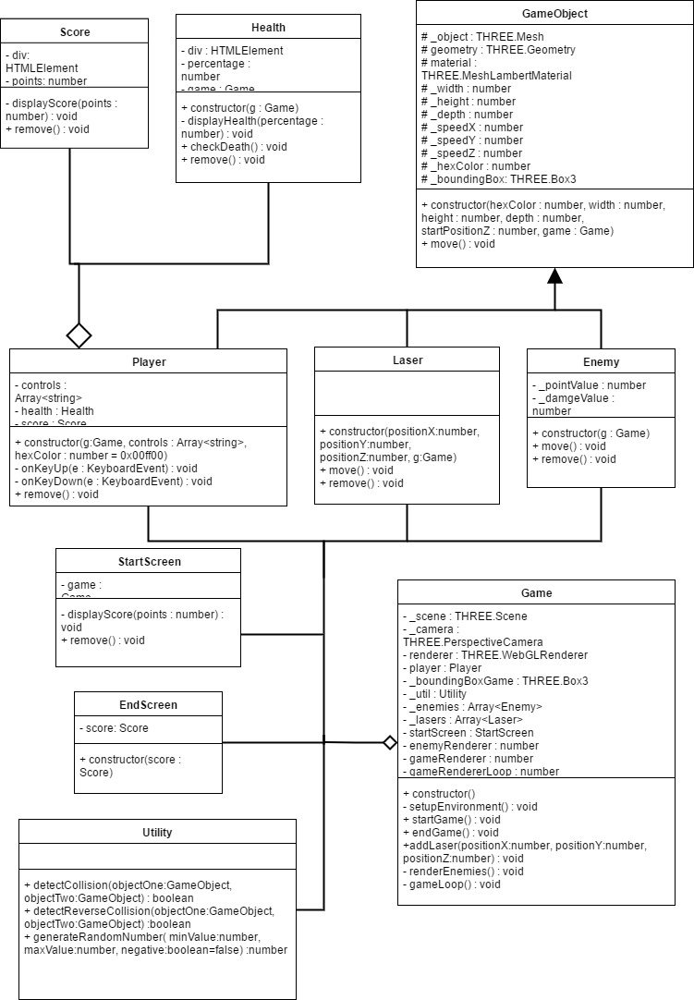

# pixelsGame

You can play the game online by going to this website: 
[http://imanidap.nl/game](http://imanidap.nl/game "Pixels")

This was a school assignment. The idea was that you could make whatever game you wanted to make as long as you used typescript and used some specific prinicples within object oriented programming. 

## UML
The following image is a representation of how the different objects relate to eachother. 



## Encapsulation
All the properties of an object are private to protect them. I have written getters and setters for properties that are needed outside of the class. Only methods I just want to call within the class and nowhere else are private. 

A short example of this is [`Score`](dev/score.ts "Go to the Score class"). 
```typescript
class Score {
    private div : HTMLElement; 
    private _points : number; 

    get points(){
        return this._points; 
    }

    set points(value){
        this._points = value; 
        this.displayScore(this._points);
    }

    //Some Code

    private displayScore(points : number) : void {
        this.div.innerHTML = "Score: " + points; 
    }

    public remove() : void {
        this.div.remove(); 
    }

}
```

## Inheritance
To save myself a lot of time I made a class called [`GameObject`](dev/gameObject.ts "Go to the GameObject class"). This class has all the basic properties and methods for object that are part of the game. The constructor makes sure the object is put in the game and creates a boudingbox so collosion with the object can be detected.

An example of a child class form the `GameObject` is [`Laser`](dev/laser.ts "Go to the Laser Class").
```typescript
class Laser extends GameObject{

    constructor(positionX : number, positionY : number, positionZ : number, g : Game){
        super(0x00ff00, 0.1, 0.1, 0.3, 0, g); 
        this.object.position.set(positionX, positionY, positionZ); 
        this._speedZ = -0.1; 
    }

    move() : void {
        super.move();

        if(this.object.position.z > 10){
            this.game.scene.remove(this.object);
        }

        if(this.object.position.z < -80){
            this.game.scene.remove(this.object); 
        }
    }

    //some code
}
```

## Composition
Instead creating an instance of every class within `Game` I used composition to distibute the code. A good example of my use of composition is the relationship between `Player` and `Health`. 
Because `Health` is something that the player has I made it a property of player. To check if the player has died I wrote the `checkDeath` method in `Health`. The only thing is that I have to check the health within the `gameLoop` in `Game`. By write a getter for `Health` in `Player` I can execute `checkDeath` without making an instance of `Health` in `Game`.

The explanation above shown as code in `Game`:
```typescript
class Game {
    //A lot of code

    private gameLoop() : void {
        if(this.player){
            //more code
            if(this._player.health.checkDeath()){
            this.endGame();
            return; 
        }

        this._player.move();
        }
        
        //even more code
    }

}
```